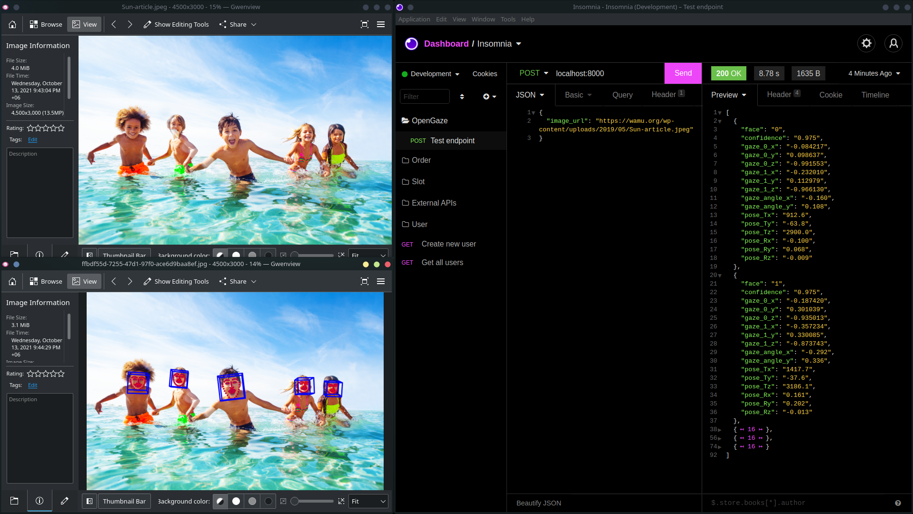

# OpenGaze: Web Service for OpenFace Facial Behaviour Analysis Toolkit


## Overview

[OpenFace](https://github.com/TadasBaltrusaitis/OpenFace) is a fantastic tool intended for computer vision and machine learning researchers, the affective computing community, and people interested in building interactive applications based on facial behavior analysis. OpenFace is the first toolkit capable of facial landmark detection, head pose estimation, facial action unit recognition, and eye-gaze estimation with available source code for running and training the models.

Even though the documentation of this tool is very detailed and organized, it is still problematic to use in web services because of its C++ codebase and CLI interface.

OpenGaze is a single endpoint RESTful web API service with [HTTP Basic Authentication](https://developer.mozilla.org/en-US/docs/Web/HTTP/Authentication#basic_authentication_scheme) developed with [FastAPI](https://github.com/tiangolo/fastapi) framework that uses the `FaceLandmarkImg` executable of OpenFace and provides a web API that responds with crucial **eye-gaze** and **head-pose** related fields.



## Installation

### OpenFace Installation

Follow the installation instruction of OpenFace to install it first with all the dependencies. Platform based installation instructions are as follows-

| OS          | Installation Instruction     |
| :---        |          :--- |
| Unix-like   | [View Wiki](https://github.com/TadasBaltrusaitis/OpenFace/wiki/Unix-Installation)   |
| Windows     | [View Wiki](https://github.com/TadasBaltrusaitis/OpenFace/wiki/Windows-Installation)
| Mac         |[View Wiki](https://github.com/TadasBaltrusaitis/OpenFace/wiki/Mac-installation)          |

The `install script` for Unix-like systems only work for Debian-based systems including ubuntu. For other distros, please install the dependencies manually and then compile the code following the `Advanced Ubuntu Installation` section.  

At the end of third step of [`Actual OpenFace installation`](https://github.com/TadasBaltrusaitis/OpenFace/wiki/Unix-Installation#actual-openface-installation) following command can be used to install the executables in the system.

```bash
make install
```

> If `make install` is not used, `FACE_LANDMARK_IMG_EXEC_COMMAND` environment variable in `.env` file will need to be updated with the absolute path of the `FaceLandmarkImg` executable. e.g., `/home/user/OpenFace/build/bin/FaceLandmarkImg`

### Run OpenGaze

#### Clone this repo

```bash
git clone https://github.com/nsssayom/OpenGaze.git
cd OpenGaze
```

#### Install virtualenv package for your OS. For Debian-based systems-

```bash
sudo apt update
sudo apt install python3-virtualenv
```

#### Create and activate a virtual environment.

```bash
virtualenv env
source env/bin/activate
```

#### Install dependencies using pip.

```bash
pip install -r requirements.txt
```

#### Run OpenGaze

```bash
uvicorn main:app --reload 
```

## Usages

Now, test the API with any API testing tool. cURL snippet is following

```bash
curl --request POST \
  --url http://localhost:8000/ \
  --header 'Authorization: Basic <RandomHeader>' \
  --header 'Content-Type: application/json' \
  --data '{
	"image_url": "https://wamu.org/wp-content/uploads/2019/05/Sun-article.jpeg"
}'
```

> use `API_KEY` value in `.env` file as username and `API Secret` as password for basic authentication.